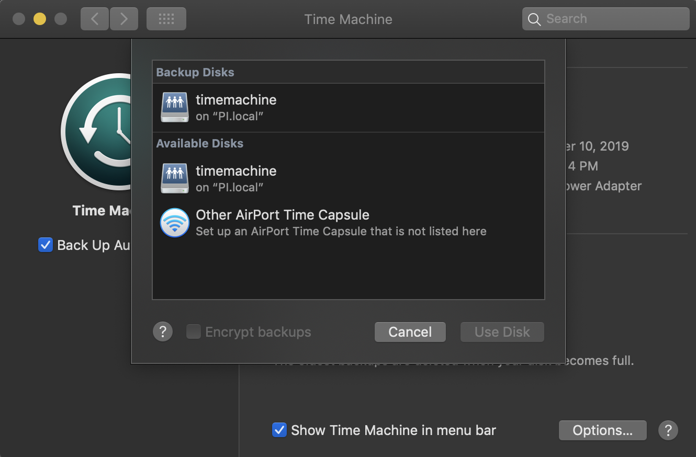
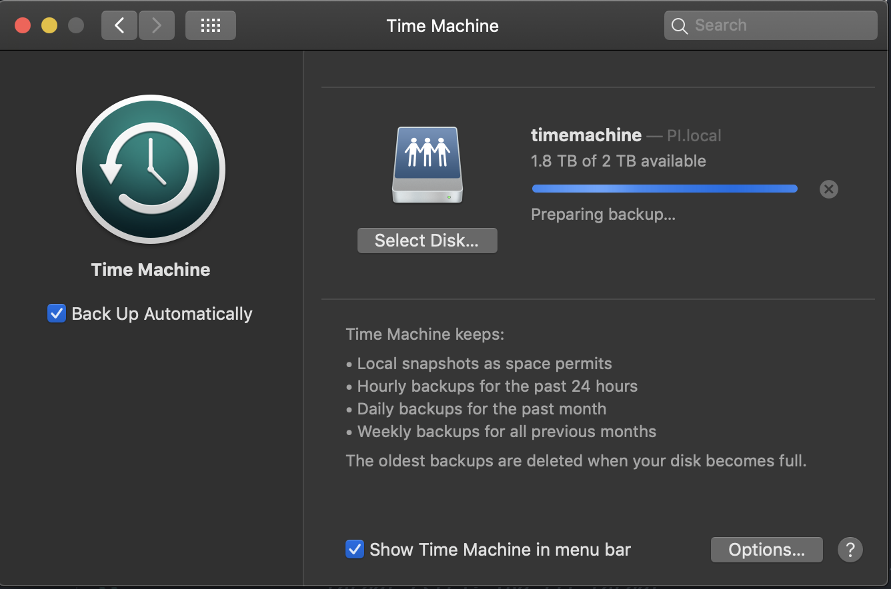
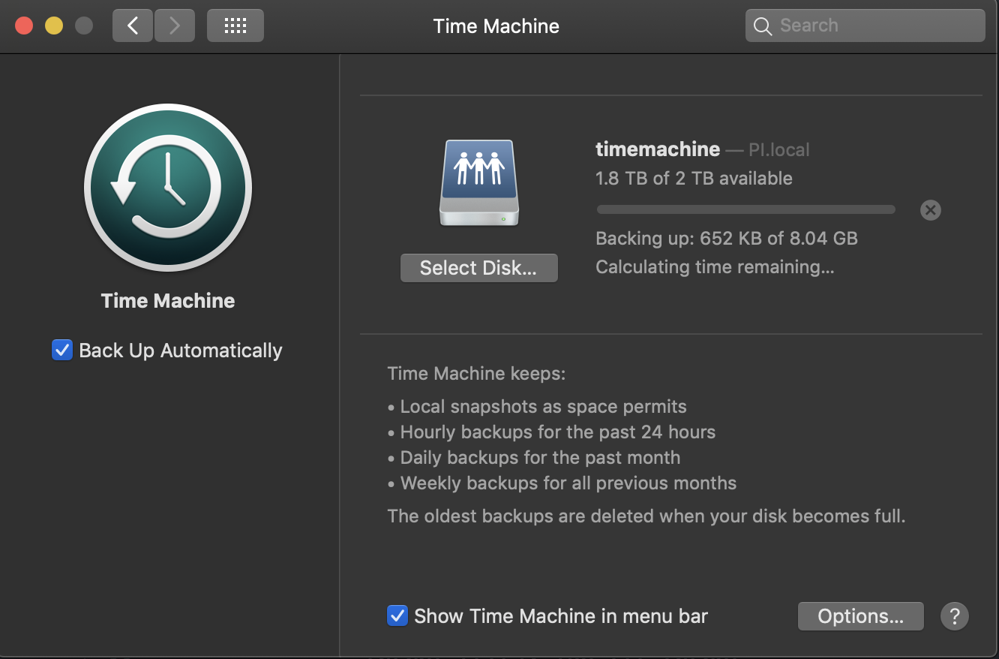
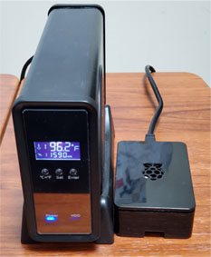

# How to build a Time Machine backup with a Raspberry Pi that just works. 

[https://johnkimdev.github.io/raspberry-pi-time-machine-how-to](https://johnkimdev.github.io/raspberry-pi-time-machine-how-to)


UPDATED: April, 2020

TOTAL INSTALLATION TIME: 30 mins (without RPi SD image download and flashing time)

# Known Issue
If your Mac has an older MacOS, it may not able to find the Time Machine (Samba) drive automatically. I have two Macs, one with 10.15, catalina and another one with 10.11 El Capitan. Everything works perfectly on 10.15 but in 10.11, it was not able to connect to the RPi Time Machine drive. There are some suggested workaround solutions on Web but I will leave you to find out if you run into this issue. (FYI, I couldn't make mine work on 10.11 either) 

# Hardware
* Raspberry Pi 3, 3b, 3b+, or 4 
* 8GB or more SD card 
* External USB Storage Drive (HDD, SDD, USB Drive, etc)
* Wired/Ethernet (recommended) or wifi internet connection

# Installation Steps
1. Download "Raspbian Buster with Desktop" [https://downloads.raspberrypi.org/raspbian_latest](https://downloads.raspberrypi.org/raspbian_latest) and flash a SD card
	* Windows/Mac/Linux SD Image Writer: [https://www.balena.io/etcher](https://www.balena.io/etcher) 	 
2. Start Raspbian OS > **Menu** > **Preferences** > **Raspberry Pi Configuration** > **Interfaces** (TAB) > **SSH** > **Enabled** > OK
3. Connect your USB external HDD 
4. Connect a wired/Ethenet cable or setup a wifi for internet connection
5. Open Raspbian OS terminal or ssh to RPi `ssh pi@<RPi_IP_Address>`
6. Type the following commands in the terminal or SSH console.

	```console
	sudo apt-get update
	```
	```console
	sudo apt-get upgrade
	```
	```console
	sudo apt-get install gparted hfsprogs hfsutils hfsplus samba samba-common-bin
	```

7. `lsblk` and the find the mountpoint of the external HDD, for example;

	```
	NAME        MAJ:MIN RM  SIZE RO TYPE MOUNTPOINT
	sda           8:0    0  3.7T  0 disk /dev/sda
	mmcblk0     179:0    0  7.2G  0 disk
	├─mmcblk0p1 179:1    0  256M  0 part /boot
	└─mmcblk0p2 179:2    0    7G  0 part /
	```	
	*MOUNTPOINT* for the external HDD (in this example) is **/dev/sda**. <-- NOTE THIS INFORMATION
	
8.	External HDD Format: Continue type the command in the terminal
	
	(Replace **/dev/sda** witht the *mounting location* information from STEP 7)
	
	```console
	sudo umount /dev/sda2
	```
	```console
	sudo parted /dev/sda storage hfsplus
	```
	
9. `sudo blkid /dev/sda` and get the UUID of the newly formated external HDD. For example; 
	```
	/dev/sda: UUID="71eb5d27-232d-9438-a9f7-bcf23423e2fa6a" LABEL="untitled" TYPE="hfsplus"
	```

	UUID: **71eb5d27-232d-9438-a9f7-bcf23423e2fa6a**  <-- NOTE THIS INFORMATION
	
10.	Mounting and Configuration: Continue type the command in the terminal 

	(replace **71eb5d27-232d-9438-a9f7-bcf23423e2fa6a** witht the *UUID* information from STEP 9)
	
	```console
	mkdir /home/pi/shared
	```

	```console
	echo "UUID=71eb5d27-232d-9438-a9f7-bcf23423e2fa6a /home/pi/shared hfsplus force,rw 0 2" | sudo tee -a /etc/fstab
	```

	```console
	sudo mount -a
	```

	```console
	sudo chown pi:pi /home/pi/shared
	```

	```console
	sudo chmod 777 /home/pi/shared
	```
	
11.	Samba Configuration: Continue type the command in the terminal 

	```console
	sudo tee -a /etc/samba/smb.conf > /dev/null <<EOT
	[TimeMachine]
	comment = Time Machine
	path = /home/pi/shared
	browseable = yes
	writeable = yes
	create mask = 0600
	directory mask = 0711
	spotlight = yes
	vfs objects = catia fruit streams_xattr
	fruit:aapl = yes
	fruit:time machine = yes
	public = yes
	EOT
	```

	```console
	sudo smbpasswd -a pi
	```
	
	```console
	sudo hostnamectl set-hostname TimeMachine
	```
	
12. All done	

	```console
	sudo reboot
	```

# Test
From your mac, **Settings** > **Time Machine**






	
# Comments

**Step 1: Raspbian OS Image**
* You don't really need a desktop version image of Raspbian OS. All installation steps above are for command line inputs. You can check out the download page for other image options. [https://www.raspberrypi.org/downloads/raspbian/](https://www.raspberrypi.org/downloads/raspbian/)

* If you don't use a desktop version image, you can use a smaller size of SD card.

* For the main backup storage, it might be a good idea to use 1TB or more drive

* (TIP) When downloading an image from https://www.raspberrypi.org/downloads page, using a torrent option is much faster than the direct download. 

**Step 2: SSH**
* If you choose to use the minimal image (without desktop version), make sur to enable SSH during the setup.

**Step 4: Wifi vs. Ethernet**
* You can use wifi, but an ethernet connection is better for speed and reliability. 

**Step 5: IP Address**
* one of the ways to find IP address is open a terminal and type `ifconfig` 

**Step 6: GParted**
* If you want to divide your hard drive or use a potion of the main SD card, it might be easier to use a GUI version, (if you are using a desktop version OS), go to **Menu** > **System Tools** > **GParted** 

**Step 10: Mounting Location**
* For `mkdir /home/pi/shared` command and other mounting location information */home/pi/shared*, you can choose any location but it is important that you need to set the owner and permission.  

**Step 11: Samba Configurations**
* The long command `sudo tee -a /etc/samba/smb.conf ...` is SINGLE command, copy entire block of codes and paste and execute.

* In the command of `sudo tee -a /etc/samba/smb.conf ...`, the text "**[Time Machine]**" (without brackets) will show up as a time machine name in a Mac Time Machine dialog. You can name it whatever you want.

* `sudo smbpasswd -a pi` You can create multiple samba users, and it _does not_ have to be the same username as a RPI SSH user. I just chose *pi* as a samba username to be consistent, but it can be anything. If you have multiple users at home and need to control each user's usage access, it might be a good idea to create an account for each samba user.

* `sudo hostnamectl set-hostname TimeMachine` This is an optional command. The RPi hostname shows up in the sidebar of a mac under "Locations". The hostname can be anything but no white space or punctuation characters allow. [https://en.wikipedia.org/wiki/Hostname](https://en.wikipedia.org/wiki/Hostname)

**Post Installation: Initial Backup**
* _It is normal to take a long time_ during the first backup process. It can takes hours (mine took over 9 hours). It is a good idea to run the first backup overnight with a wired (ethernet) connection. BTW it is OK to interrupt a backup process; it will resume during the next scheduled time. The backup process will be shorter after completing the initial backup. 

# My Final Setup

* Raspberry Pi 3
* Raspbian Buster with desktop image
* SandDisk 8GB SD
* Toshiba NAS N300 4TB HDD
* Rosewill USB 3.0 eSATA 3.5” Aluminum SATA Enclosure


